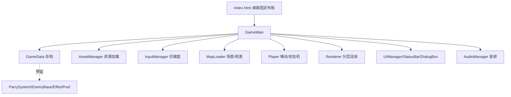

## 产品概述

按《五行轮回：烛龙囚笼》开发文档搭建阶段1（底层框架）的纯桌面端（PC）多文件游戏引擎。游戏入口为新建 `wuXingCycle/` 目录，不覆盖现有无关原型。无素材时使用程序化占位绘制（矩形/水墨曲线）保证立即可玩，素材路径常量化以便后续替换真实美术。

## 核心功能

- 项目目录骨架：index.html、css/（reset/game-ui/animation，无移动端适配文件）、js/(core/player/map/ui/audio/effect/enemy/utils)、config/、assets/ 占位。
- 存档系统：键名 wuXingCycleSave，JSON 存 localStorage；首次进入初始化1级空白存档；无存储权限弹窗容错；预留真结局清空接口。
- 输入管理：仅键盘 WASD/方向键移动、空格跳跃（移除全部触屏/虚拟摇杆/虚拟按键逻辑）。
- 渲染框架：Canvas 2D 分层（场景层→角色层→特效层→UI层），固定960x540 桌面居中布局，后台切页暂停主循环与音频。
- 角色系统：Player 类实现上下左右自由移动、跳跃、边界限制与 idle/walk/jump 状态机；程序化占位绘制（深灰矩形+水墨曲线背景）。
- 资源加载框架：config/assetList.json 预加载清单，加载失败跳过并提示，不阻塞启动；音频首次点击后加载。
- UI框架：顶部状态栏（等级/觉醒/HP/MP/经验）、首次操作说明弹窗、DialogBox 提示弹窗。
- 预留接口：ParrySystem、EnemyBase、EffectPool、ShockWave、SkillSystem 仅建类骨架，阶段1不实现逻辑。

## 移除项（本次明确不做）

- 所有 @media 媒体查询与响应式断点（CSS 仅桌面固定布局）。
- 移动端虚拟摇杆、虚拟按键 DOM 与 touch 事件监听。
- 移动端专用 meta viewport 设置（保留标准 charset/viewport 即可）。
- 不创建 mobile-adapt.css 触屏相关文件。

## 技术栈选择

- 原生 HTML5 + CSS3 + ES6 JavaScript（禁用 var，ES6 class 封装，面向对象）。
- 渲染：原生 Canvas 2D（单 Canvas 按层顺序绘制，降低复杂度且易扩展）。
- 音频：Web Audio API / HTML Audio 动态创建，首次用户交互后初始化。
- 存档：localStorage，键名固定 wuXingCycleSave。
- 部署：纯静态，复用现有 server.js（端口5173）本地预览，后续 CloudStudio 部署。

## 实现方案

采用分层模块化架构，将引擎核心（主循环、渲染、输入、存档）与游戏内容（玩家、地图、UI）解耦。所有固定数值外置到 config/*.json，由 GameData 与常量管理器统一读取，杜绝硬编码。资源加载采用"尝试预加载+失败回退程序化绘制"策略：启动时读取 assetList.json，逐张加载图片，失败则标记占位并继续，确保无素材也能运行。主循环以 requestAnimationFrame 驱动，deltaTime 帧率无关；timeScale 与 freezeTimer 在 GameMain 中统一更新（阶段1仅初始化变量，供后续卡肉复用）。

关键技术决策：

1. 模块化按文档目录拆分，后续新增 enemy/map/技能仅加文件不改核心（符合拓展预留规范）。
2. 资源路径常量集中管理（ASSETS_BASE），后续替换美术无需批量改路径。
3. 状态机用枚举常量+互斥切换，避免动作冲突（为阶段2战斗铺垫）。
4. 渲染分层用单 Canvas 按层顺序绘制，阶段1降低复杂度。
5. 输入仅键盘（WASD/方向键/空格），完全移除触屏监听与虚拟控件，CSS 仅桌面固定居中布局。

性能与可靠性：主循环按 deltaTime 节流；后台 visibilitychange 暂停循环与音频；资源加载失败容错不阻塞；对象池仅预留，避免提前过度设计。

## 实现说明

- 复用 server.js 静态服务做本地验证；新游戏入口为新建 wuXingCycle/index.html（不覆盖现有无关 index.html）。
- 所有新增 JS 用 ES6 class，禁止 var；数值取自 config/*.json。
- 程序化绘制：背景贝塞尔曲线水墨山峦，角色深灰矩形，UI 暗红+墨黑。
- 日志用 console（阶段5上线前清理），避免阻塞。

## 架构设计

核心数据流：index.html 加载 css/js → GameMain 启动 → GameData 读档/初始化 → AssetManager 预加载 → InputManager 绑定键盘 → MapLoader 构建场景 → Player 创建 → 主循环(update/render 分层) → StatusBar/DialogBox 渲染。



## 目录结构

```
wuXingCycle/                       # 新建游戏根目录（不覆盖现有 index.html）
├── index.html                     # [NEW] 桌面入口页：挂载 canvas + DOM UI 层 + 首次操作说明弹窗，相对路径引用 css/js，无触屏 meta
├── css/
│   ├── reset.css                  # [NEW] 全局样式重置（桌面固定）
│   ├── game-ui.css                # [NEW] 状态栏/弹窗样式（暗红+墨黑国风，固定桌面布局）
│   └── animation.css              # [NEW] 屏幕震动/雾气/淡入淡出 @keyframes（无媒体查询）
├── js/
│   ├── core/
│   │   ├── GameMain.js            # [NEW] 主循环、timeScale/freezeTimer、后台暂停、启动编排
│   │   ├── GameData.js            # [NEW] 存档读写/初始化/清空/容错（wuXingCycleSave）
│   │   ├── InputManager.js        # [NEW] 仅键盘 WASD/方向键/空格，无 touch
│   │   ├── Renderer.js            # [NEW] 分层渲染封装
│   │   ├── Collision.js           # [NEW] 矩形/圆形碰撞检测工具
│   │   └── AssetManager.js        # [NEW] 读 assetList.json 预加载，失败回退占位
│   ├── player/
│   │   ├── Player.js              # [NEW] 移动/跳跃/边界/状态机 idle-walk-jump，程序化绘制
│   │   └── ParrySystem.js         # [NEW] 弹反类骨架（预留接口）
│   ├── map/
│   │   ├── MapLoader.js           # [NEW] 横版卷轴+视差滚动框架（单地图占位）
│   │   └── SceneData.js           # [NEW] 地图配置数据（木幽谷占位）
│   ├── ui/
│   │   ├── UIManager.js           # [NEW] UI 统管：状态栏/弹窗显隐
│   │   ├── StatusBar.js           # [NEW] 顶部状态栏：等级/觉醒/HP/MP/经验
│   │   └── DialogBox.js           # [NEW] 操作说明/解锁提示弹窗
│   ├── audio/
│   │   ├── AudioManager.js        # [NEW] 动态创建音频、首次点击加载、失败容错
│   │   └── AudioList.js           # [NEW] 音效资源配置表
│   ├── effect/
│   │   ├── EffectPool.js          # [NEW] 特效对象池骨架（预留）
│   │   └── ShockWave.js           # [NEW] 卡肉波纹骨架（预留）
│   ├── enemy/
│   │   └── EnemyBase.js           # [NEW] 敌人父类骨架（预留）
│   └── utils/
│       ├── FrameAnim.js           # [NEW] 序列帧动画管理器（预留）
│       ├── MathTool.js            # [NEW] 向量/距离/蓄力计时工具
│       └── StorageUtil.js         # [NEW] localStorage 读写封装（容错）
├── config/
│   ├── gameConst.json             # [NEW] 画布尺寸/移动速度/重力/跳跃/卡肉常量
│   ├── mapConfig.json             # [NEW] 地图节点配置（木幽谷占位）
│   ├── assetList.json             # [NEW] 预加载资源清单（空/占位，失败容错）
│   └── skillConfig.json           # [NEW] 招式数值占位（初始水行）
└── assets/
    ├── img/.gitkeep               # [NEW] 图片目录占位
    └── audio/.gitkeep             # [NEW] 音频目录占位
```

## 关键代码结构

```javascript
// GameData.js 存档结构（与文档 2.2 对齐）
const DEFAULT_SAVE = {
  cycle: 1, awakening: 0, currentMap: "woodValley",
  level: 1, exp: 0, expNeed: 100, point: 0,
  attr: { strength:1, agility:1, spirit:1, physique:1 },
  hp: 100, maxHp: 100, mp: 50, maxMp: 50,
  unlockSkill: ["water"],
  mapExplore: { woodValley:{unlock:true,box:[false,false]} },
  timeScale: 1, freezeTimer: 0
};
const SAVE_KEY = "wuXingCycleSave";
```

## 设计风格

采用国风淡墨水墨风格，专为桌面端（PC）设计。宣纸黄底(#f5f0e6)配贝塞尔曲线淡墨山峦背景，玩家为深灰矩形，UI 使用暗红(#8b0000)与墨黑配色。Canvas 固定 960x540 居中显示，外层 DOM UI 叠加顶部状态栏与首次操作说明弹窗。整体视觉克制留白，半透明水墨边框弹窗，为后续阶段美术替换预留程序化绘制框架。

## 页面布局

- 整体：桌面居中固定布局，深色背景衬托游戏画面。
- 顶层：Canvas 游戏画面（960x540，CSS 居中等比缩放），下方叠 DOM UI 层。
- 顶部状态栏：左侧等级/觉醒/周目，中部 HP/MP/经验条，右侧已解锁招式图标位（阶段1留空）。
- 首次弹窗：游戏操作说明（WASD移动、空格跳跃），可关闭，半透明水墨边框。
- 无移动端虚拟控件，无响应式断点。

## Agent Extensions

### Integration

- **cloudStudio**
- Purpose: 阶段1框架完成后，将纯静态项目部署到 Cloud Studio 静态托管。
- Expected outcome: 项目成功部署并生成可访问的静态网页地址。